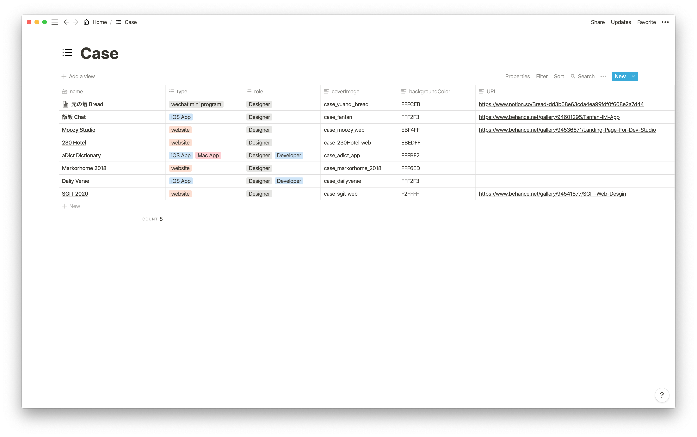
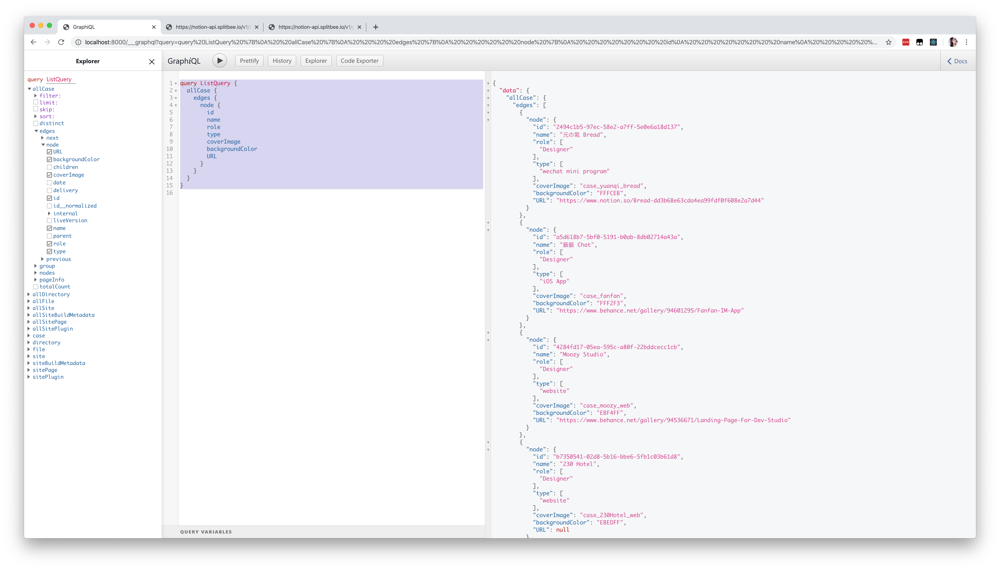
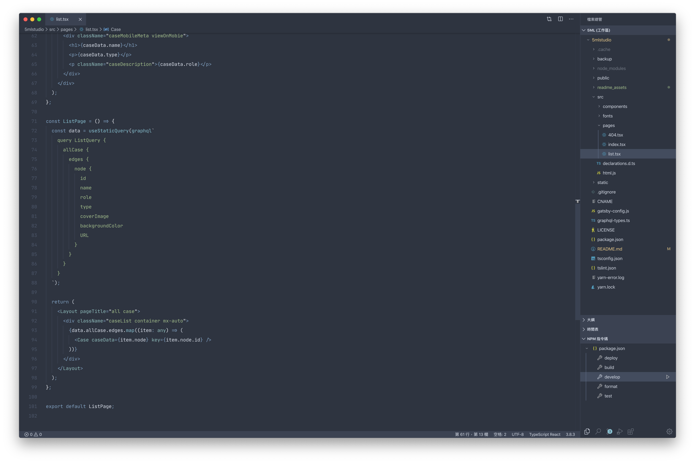

# Studio 5ml

基於 Gatsby + notion 搭建的工作室網站


## deploy

```
npm i
npm i -g gatsby-cli
npm run deploy
```


## Gatsby

這個「靜態站」採用了 Gatsby 開發。

為什麼採用 Gatsby？因為 Gatsby 具備大量的社區支持。


## notion - data source

gatsby-source-custom-api

https://www.gatsbyjs.org/packages/gatsby-source-custom-api/


使用 Gatsby 插件﹣定制 API 作為數據來源，其 case 數據儲存在 notion 上。



接著，使用基於「 https://notion-api.splitbee.io/v1/table/1b9b6c284ab14a858fd8ab36585234c0 」的 api 獲得 notion 表格數據。

此 api 可參考此項目 https://github.com/splitbee/notion-api-worker


## GraphQL





GraphQL 作為一款查詢 QL 語言，是 Gatsby 推薦的。使用 GraphQL 生成器，可很方便地把 GraphQL 的數據導入代碼。


## TypeScript

本次項目也是使用了 TS 作為開發語言，TS 具有良好的代碼提示的特性，寫起來像 Swift 一樣流暢。

不過本項目很小，所以無法體現 TS 良好的可維護性質。

